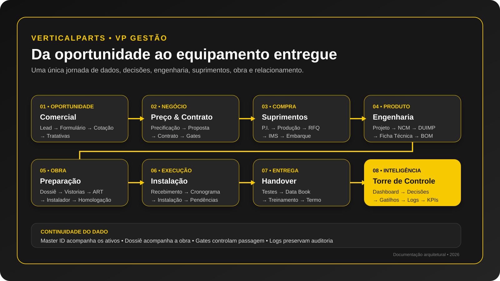

<p align="center">
  
</p>

<h1 align="center">VP Gestão</h1>
<p align="center"><strong>Da oportunidade ao equipamento entregue.</strong></p>
<p align="center">Plataforma corporativa para gestão integrada de venda, fornecimento, importação, engenharia, obra, instalação, entrega e inteligência operacional de equipamentos de transporte vertical.</p>

<p align="center">
  <a href="#-visão-executiva">Visão Executiva</a> •
  <a href="#-jornada-ponta-a-ponta">Jornada</a> •
  <a href="#-mapa-funcional">Módulos</a> •
  <a href="#-arquitetura-de-negócio">Arquitetura</a> •
  <a href="#-regras-de-governança-e-gates">Gates</a> •
  <a href="#-guia-para-humanos-e-agentes-de-ia">Guia para IA</a> •
  <a href="#-btime--vistorias-em-equipamentos-sistema-externo">Btime</a>
</p>

---

## 🎯 Visão Executiva

O nome histórico do repositório, `010_GestaoImportacao`, não descreve mais sozinho o produto atual.

O **VP Gestão começa antes da importação**: quando existe apenas uma oportunidade comercial. A partir dela, o sistema estrutura requisitos, solicita cotações, forma preço, gera proposta, formaliza contrato, governa a autorização de compra, acompanha P.I., produção, sourcing, embarque, engenharia, obra, instaladores, vistorias, instalação, documentação e entrega.

> **Definição curta:** o VP Gestão é a representação digital do ciclo empresarial da VerticalParts — do primeiro lead ao handover do equipamento.

O principal ativo do sistema não é uma tela isolada. É a **continuidade do dado** entre as etapas.

```text
Lead
  ↓
Formulário / Especificação
  ↓
Cotação a Fornecedor + Tratativas
  ↓
Precificação
  ↓
Proposta
  ↓
Contrato + Sinal + Aval + Decisão
  ↓
P.I. + Produção + RFQ + IMS
  ↓
Embarque / Aduana ─────────────┐
                              ├─→ Obra / Instalação
Engenharia / Vistorias / RH ──┘
  ↓
Testes + Data Book + Treinamento + Termo
  ↓
ENTREGUE / HANDOVER / PÓS-VENDA
```

---

## 🗺️ Jornada ponta a ponta

<p align="center">
  
</p>

A jornada deve ser lida como um **workflow empresarial**, não como uma sequência obrigatoriamente linear de páginas. Diversas atividades acontecem em paralelo — especialmente durante produção e trânsito internacional.

### Oito macroetapas

| # | Macroetapa | Fluxo principal | Pergunta de negócio |
|---|---|---|---|
| 1 | Oportunidade | Lead → Formulário → Cotação → Tratativas | Quem pode comprar e o que precisa? |
| 2 | Negócio | Precificação → Proposta → Contrato → Gates | Podemos vender, com que margem e condições? |
| 3 | Compra | P.I. → Produção → RFQ → IMS → Embarque | O que comprar, de quem e como movimentar? |
| 4 | Produto | Projeto → NCM → DUIMP → Ficha → BOM | Qual é a identidade técnica/fiscal do produto? |
| 5 | Obra | Dossiê → Vistorias → ART → Instalador → Homologação | A obra e os parceiros estão preparados? |
| 6 | Execução | Recebimento → Cronograma → Instalação → Pendências | O equipamento pode ser instalado com segurança e controle? |
| 7 | Entrega | Testes → Data Book → Treinamento → Termo | A obrigação técnica e contratual foi concluída? |
| 8 | Inteligência | Dashboard → Decisões → Gatilhos → Logs → KPIs | Onde a gestão precisa agir agora? |

---

## 🧭 Modelo mental de navegação

A sidebar é somente a primeira camada. A arquitetura real deve ser entendida assim:

```text
Sidebar
  └─ Módulo
      └─ Lista / Painel
          └─ Registro
              └─ Detalhe
                  ├─ Ação
                  ├─ Modal / Wizard
                  ├─ Documento / Preview
                  ├─ Gate / Decisão
                  └─ Evento / Automação → próxima etapa
```

Por isso, uma IA ou pessoa que analise apenas os itens do menu terá uma visão incompleta do produto. Rotas de detalhe, editores, wizards, inboxes, dossiês, timelines e estados internos fazem parte do domínio.

---

## 🧩 Mapa funcional

> **Legenda:** `Operacional` = fluxo existente/documentado no produto atual. `Planejado` = item deliberadamente apresentado como futuro e que não deve ser descrito como funcionalidade concluída.

### GERAL — Torre de Controle

**Dashboard** — consolida KPIs e muda a leitura conforme o perfil de usuário. Comercial observa pipeline e conversão; Engenharia observa projetos e pendências técnicas; Financeiro observa compromissos, gatilhos e contratos; Admin observa a operação consolidada.

**Notificações** — inbox operacional. Informa que algo ocorreu ou requer atenção. **Notificação não é decisão e não é gate.**

**Central de Decisões** — concentra situações nas quais a decisão deve permanecer humana, como autorizações executivas e decisões de contratação/vinculação.

**Gatilhos & Prazo** — sistema nervoso temporal do workflow. Trabalha com eventos automáticos e gatilhos manuais, vencimentos, status, prazo reverso, cadeias por cotação, alertas e confirmações financeiras.

### COMERCIAL — Onde a receita começa

**Leads** — pipeline de oportunidades. Registra empreendimento, contato, equipamentos, quantidades, características preliminares, origem, prioridade, responsável, valor estimado e próxima ação.

**Formulários** — transforma interesse em especificação. O mesmo núcleo atende canal interno e canal público e adapta perguntas para **Elevador, Escada Rolante e Esteira Rolante**. Múltiplas unidades devem ser tratadas como ativos individualizáveis.

**Cotações a Fornecedor** — substitui conceitualmente a antiga visão limitada de “Cotações China”. A arquitetura é orientada a fornecedor/categoria e pode evoluir para elevadores, escadas, esteiras, quadros, portas, cabines e outras categorias. Inclui histórico de **Tratativas** com mensagens e anexos.

**Precificação** — ponte Comercial/Financeiro. Transforma resposta de fornecedor em preço comercial por meio de custos de importação, câmbio, tributos, DIFAL, serviços, instalação, markup, comissões e margem. Calcular e aprovar são estados distintos.

**Propostas** — editor comercial estruturado com herança de dados, ativos, valores, condições, especificações, imagens/desenhos e preview. O objetivo é evitar redigitação e impedir especificações fictícias ou divergentes da venda.

### ADM / FINANCEIRO — Proteção econômica da operação

**Precificação** — protege margem e coerência fiscal antes da promessa comercial.

**Aval Financeiro** — participa do gate de compra e responde se a operação está financeiramente apta a comprometer caixa.

### CADASTROS — Fontes de verdade transversais

**Clientes** — cadastro central utilizado por Comercial, Importação, Engenharia e demais áreas.

**Fornecedores** — cadastro central utilizado por P.I., RFQ, IMS, embarques e compras; inclui avaliação e base para evolução de Supplier Scorecard.

**Produtos** — catálogo associado a NCM, solicitações NCM, DUIMP, ficha técnica e dados técnicos/fiscais.

### JURÍDICO — Formalização do compromisso

**Contratos & Minutas** — gestão de minutas, preenchimento, redação, status e assinatura digital.

**Contrato de Venda de Equipamentos** — wizard especializado que pode herdar Proposta/Master ID e conduz cadastro do comprador, objeto, logística, preço e condições contratuais.

**Contrato Instalador** — módulo especializado com modalidade, partes, objeto, seleção granular de ativos, engine, preview e assinatura. Um instalador pode ser contratado para apenas parte dos equipamentos de uma proposta.

### IMPORTAÇÃO / SUPRIMENTOS — Compra e movimento internacional

Existem duas camadas que não devem ser confundidas:

1. **Importação tradicional** — visão histórica, detalhe de embarque, rastreamento marítimo/AIS e inbox.
2. **Gestão Importação** — fluxo operacional estruturado em Painel, P.I., RFQ, IMS, Embarques e Análise de Preços.

**Painel Gestão Importação** — cockpit que consolida P.I., RFQ, IMS e embarques.

**P.I. — Proforma Invoice** — fonte financeira e operacional da compra: fornecedor, Incoterm, itens, NCM, valores, pagamentos, câmbio, produção, Cargo Ready, anexos e vínculo com embarque. A criação pode ser bloqueada quando o gate de compra não estiver satisfeito.

**RFQ** — matriz de sourcing com múltiplos fornecedores, moedas, itens, preços e escolha de vencedor por item ou global.

**IMS** — planejamento e contratação de recursos físicos/serviços, incluindo transporte, Munck, empilhadeira, andaime, mão de obra e outros recursos, com planejamento, fornecedores e execução.

**Embarques** — consolidador logístico. Herda informações das P.I.s, controla containers, NF-e, ETD original/atual, rolagens, eventos aduaneiros e etapas de entrega.

**Análise de Preços** — reaproveita histórico das RFQs para transformar memória de sourcing em inteligência de compra.

**Compras Nacional** — separa sourcing doméstico da aquisição internacional.

**Pedidos** — abrange pedido ao fornecedor e acompanhamento do cumprimento do pedido.

### ENGENHARIA — A especificação toma posse

**Projetos de Engenharia** — visita, levantamento, laudo, BOM, documentos, vínculo com NCM/Ficha e gates para Importação.

**Projeto de Elevadores** — engenharia especializada do equipamento elevador.

**Projeto de Equipamento** — configurador técnico que transforma requisitos em especificação concreta e alimenta BOM, ficha, proposta, contrato e projeto.

**Projetos ER/ES** — desenho técnico especializado para Escadas Rolantes e Esteiras Rolantes.

**Ficha Técnica** — wizard universal, dashboard e impressão técnica. Permite categorias/campos extensíveis, templates, imagens, desenho técnico e sincronização com catálogo. Possui contexto de copiloto especialista próprio.

### OBRA — O prontuário operacional

**Status de Obras** — visão consolidada das obras e de seu Status Mestre.

**Dossiê da Obra** — prontuário central da obra: visão geral, documentos, instalação, cronograma, pendências, responsáveis e histórico. É uma entidade central do domínio, mesmo não sendo apenas um item simples da sidebar.

Status Mestre modela a progressão de negócio e execução, por exemplo:

```text
Lead qualificado → Dossiê criado → Análise técnica → Precificação →
Proposta enviada → Contrato assinado → Importação → Homologação instalador →
Instalação → Data Book → Entregue → Manutenção preventiva
```

**Vistorias de Obras** — fonte única de verdade para vistorias. Controla agendamento, vistoriador, tipo/fase, custo, observações, documentos, imagens e estados. As três fases contratuais concluídas podem liberar a obra.

**ART** — responsabilidade técnica e documentação que pode ser antecipada antes da chegada física do equipamento.

### RECURSOS HUMANOS — Gate operacional

**Homologação de Parceiros Instaladores** — controla habilitação documental/técnica de parceiros e distingue **homologação geral** de **vínculo específico à obra**. Documentos podem incluir NR-10, NR-35, ASO, PCMSO e PGR.

### INSTALAÇÃO — Encontro entre produto e obra

A instalação deve respeitar gates. O fluxo mapeado considera, entre outros requisitos, contrato, liberação financeira, projeto recebido e instalador corretamente vinculado.

O domínio também contempla recebimento do equipamento, responsáveis, equipe de recepção, cronograma, status, pendências, testes e linha do tempo.

### ENTREGA — Encerramento técnico e contratual

**Data Book & Termo** — reúne memória documental e evidências de conclusão.

Uma entrega completa pode envolver:

1. ART registrada/entregue;
2. Data Book;
3. equipamento testado e funcionando;
4. manuais e documentação;
5. aceite/assinatura documental;
6. certificados;
7. treinamento;
8. suporte;
9. garantia explicada;
10. Termo de Entrega;
11. transição para manutenção/pós-venda.

> **Equipamento funcionando não é sinônimo de projeto contratualmente encerrado.**

### LOGÍSTICA

**Almoxarifado** — controle operacional de materiais/estoques.

**Expedição** — **Planejado**. Não documentar como módulo funcional concluído enquanto permanecer marcado como planejado.

**Logística** — **Planejado**. Mesma regra acima.

### PORTAL ADMIN — Governança

**Logs de Atividade** — trilha de auditoria: quem fez o quê, quando, onde e sobre qual objeto.

**Configurações do Sistema** — parâmetros administrativos e governança de acesso/alocação de módulos por colaborador.

---

## 🔑 Arquitetura de negócio

### Master ID

Identidade persistente que permite que oportunidade/equipamento sobreviva à troca de documentos e etapas. Deve preservar rastreabilidade entre ativos, precificação, proposta, contratos e demais entidades relacionadas.

### Dossiê da Obra

Enquanto o **Master ID acompanha o ativo**, o **Dossiê acompanha a obra**. São conceitos complementares, não sinônimos.

### Fontes de verdade

O sistema deve evitar bases paralelas para o mesmo fato. Exemplos de intenção arquitetural:

- P.I. como fonte financeira da compra;
- Embarque como consolidador logístico;
- `vistorias_obras` como fonte única das vistorias;
- Cadastro Central como origem para clientes/fornecedores/produtos;
- Dossiê como prontuário da obra;
- Logs como trilha de auditoria.

### Herança de dados

Princípio fundamental: **não redigitar o que o pipeline já sabe**.

```text
Cliente / Obra
   ↓
Lead → Formulário → Cotação → Precificação → Proposta → Contrato
                    ↓                         ↓
                 Master ID ───────────────→ Ativos
                    ↓
                   P.I. → Embarque

Dossiê da Obra ← Engenharia / Vistorias / ART / Instalador / Instalação
```

---

## 🚦 Regras de governança e Gates

O VP Gestão não deve tratar “próxima etapa” como um botão livre. Gates existem para impedir avanço indevido.

### Gate de compra

```text
Decisão executiva / CEO
        AND
Contrato assinado
        AND
Sinal confirmado
        AND
Aval financeiro
        ↓
COMPRA LIBERADA
```

### Gate técnico / importação

Pré-requisitos técnicos, documentais e contratuais devem estar satisfeitos antes da liberação correspondente.

### Gate de instalação

```text
Contrato / condição contratual
        AND
Liberação financeira aplicável
        AND
Projeto / documentação técnica
        AND
Instalador habilitado e vinculado
        ↓
INSTALAÇÃO LIBERADA
```

**Princípio:** automação verifica fatos; decisões empresariais relevantes permanecem explícitas e auditáveis.

---

## ⚡ Paralelismo operacional

Uma das maiores oportunidades de redução de lead time está no período em que equipamento está em produção ou em trânsito.

Enquanto a carga cruza o oceano, podem avançar em paralelo:

- engenharia e revisão técnica;
- vistorias;
- homologação e contratação de instaladores;
- ART;
- andaime, Munck e recursos IMS;
- planejamento de recebimento;
- preparação física da obra;
- cronograma e mobilização.

O ERP deve, portanto, **orquestrar trabalho futuro**, e não apenas registrar fatos passados.

---

## 🧠 Inteligência e automação

**Dashboard** observa o processo.

**Notificações** informam eventos.

**Central de Decisões** solicita decisão humana.

**Gatilhos & Prazo** encadeiam obrigações e datas.

**Logs** preservam evidência.

**Análise de Preços** transforma RFQs passadas em memória de sourcing.

**Copiloto VP** adiciona assistência contextual; áreas especializadas podem possuir copilotos próprios.

**AIS** sustenta rastreamento marítimo, separado do fluxo operacional de Embarques.

**NCM / DUIMP** sustentam classificação e preparação fiscal/técnica.

**Omie** pode receber/publicar dados de integração, evitando que o VP Gestão se torne uma ilha.

---

## 🖼️ Identidade visual e famílias de produto

<p align="center">
  
  
  
</p>

> As imagens acima representam famílias de produto existentes no repositório. Capturas de tela devem ser adicionadas somente quando corresponderem à UI atual; documentação visual desatualizada é pior do que ausência de screenshot.

### Padrão recomendado para screenshots

Ao adicionar telas reais, salvar em `docs/screenshots/` com nomes estáveis, por exemplo:

```text
docs/screenshots/01-dashboard.png
docs/screenshots/02-leads.png
docs/screenshots/03-formulario-elevador.png
docs/screenshots/04-cotacoes-fornecedor.png
docs/screenshots/05-precificacao.png
docs/screenshots/06-proposta.png
docs/screenshots/07-pi.png
docs/screenshots/08-embarques.png
docs/screenshots/09-dossie-obra.png
docs/screenshots/10-ficha-tecnica.png
```

---

## 🛠️ Stack e execução

O repositório utiliza uma arquitetura web orientada ao portal interno, com React no frontend, CSS próprio, Supabase/PostgreSQL como camada de dados e serviços/Edge Functions para integrações e automações. O servidor do projeto também contempla entrega de arquivos estáticos e integração com o ambiente corporativo.

> **Importante para agentes:** antes de alterar stack, deploy, autenticação, IDs de projeto ou infraestrutura, valide o código/configuração corrente. Esta documentação privilegia o **domínio de negócio** e evita transformar detalhes voláteis de infraestrutura em premissas permanentes.

### Segurança

- sistema corporativo, não destinado a exposição pública irrestrita;
- respeitar autenticação e autorização existentes;
- nunca commitar secrets, tokens ou credenciais;
- aplicar princípio de menor privilégio;
- preservar RLS/políticas do Supabase quando aplicável;
- decisões, aprovações e mudanças críticas devem ser auditáveis.

---

## 🤖 Guia para humanos e agentes de IA

Se Você é uma pessoa, Claude Code, Codex, ChatGPT ou outro agente trabalhando neste repositório, siga estas regras antes de modificar o produto:

1. **Entenda a jornada antes da tela.** Descubra de onde o dado vem e quem o consome depois.
2. **Não crie uma segunda fonte de verdade** sem necessidade arquitetural comprovada.
3. **Preserve Master ID, vínculos e rastreabilidade** entre ativos/documentos.
4. **Não contorne gates** para “fazer funcionar”. Gates são controles de negócio.
5. **Não confunda notificação, gatilho e decisão.** São conceitos distintos.
6. **Não redigite dados existentes.** Prefira herança/vínculo entre entidades.
7. **Diferencie estado implementado de estado planejado.** `planned` não é funcionalidade pronta.
8. **Preserve histórico.** Negociação, rolagens de ETD, decisões, pagamentos e eventos relevantes precisam de trilha.
9. **Trate a P.I. como fonte da compra e o Embarque como consolidador logístico**, salvo mudança arquitetural deliberada.
10. **Trate o Dossiê como prontuário da obra** e vistorias oficiais como dados estruturados, não notas soltas.
11. **Pense em paralelismo.** Engenharia e preparação de obra podem avançar durante produção/trânsito.
12. **Antes de criar um módulo novo, procure componente, store, tabela, função ou rota existente** que já represente o domínio.
13. **Atualize documentação junto com mudanças estruturais.** Se o fluxo mudou, este README não pode ficar para trás novamente.

### Checklist mínimo antes de uma alteração

```text
[ ] Qual problema empresarial estou resolvendo?
[ ] Qual entidade é a fonte de verdade?
[ ] Existe Master ID / Dossiê / Cotação / P.I. relacionado?
[ ] A mudança afeta algum gate?
[ ] Há dados que podem ser herdados em vez de duplicados?
[ ] Há impacto em permissões/RLS?
[ ] Há impacto em logs/auditoria?
[ ] Há impacto em documentos/PDF/assinatura?
[ ] Há impacto em integrações (Omie, AIS, NCM/DUIMP etc.)?
[ ] Testes e documentação foram atualizados?
```

---

## 📚 Leitura do produto por volume

Para documentação aprofundada, a jornada pode ser estudada em oito volumes:

| Volume | Tema | Escopo |
|---|---|---|
| I | A oportunidade | Lead → Formulário → Cotação → Tratativas |
| II | O negócio | Precificação → Proposta → Contrato → Decisões → Gatilhos |
| III | A compra | P.I. → Produção → RFQ → IMS → Embarque → Aduana |
| IV | O produto | Cadastros → Produtos → NCM → DUIMP → Ficha Técnica |
| V | A obra | Engenharia → Projeto → Dossiê → Vistorias → ART → Instalador → Homologação |
| VI | A execução | Recebimento → Instalação → Cronograma → Status → Pendências |
| VII | A entrega | Data Book → Testes → Treinamento → Termo → Handover |
| VIII | A inteligência | Dashboard → Decisões → Gatilhos → Alertas → Logs → Análise de Preços → KPIs |

---

## 🧾 Glossário essencial

| Termo | Significado no VP Gestão |
|---|---|
| Master ID | Identidade persistente que conecta ativos ao longo da jornada |
| Dossiê | Prontuário operacional/documental da obra |
| Gate | Regra de liberação que exige pré-condições antes do avanço |
| Gatilho | Evento/prazo derivado de uma condição anterior ou criado manualmente |
| Notificação | Informação de que algo aconteceu ou exige atenção |
| Decisão | Ato humano explícito que não deve ser inferido por automação |
| P.I. | Proforma Invoice e fonte principal da compra internacional |
| RFQ | Request for Quotation / matriz de sourcing |
| IMS | Solicitação/gestão de recursos físicos e serviços da operação |
| Cargo Ready | Marco de prontidão da mercadoria para embarque |
| ETD | Estimated Time of Departure |
| AIS | Automatic Identification System, usado no contexto de rastreamento marítimo |
| NCM | Nomenclatura Comum do Mercosul |
| DUIMP | Declaração Única de Importação |
| BOM | Bill of Materials |
| ART | Anotação de Responsabilidade Técnica |
| Data Book | Dossiê documental técnico de entrega |
| Handover | Transição formal do projeto entregue para cliente/pós-venda |

---

## 🧱 Princípio de produto

> **O VP Gestão não é uma coleção de módulos. É uma cadeia de continuidade empresarial.**

O cliente informado no início reaparece na proposta. A cotação reaparece na precificação. A precificação alimenta a proposta. A proposta alimenta contratos. O Master ID preserva os ativos. A P.I. alimenta o embarque. O Dossiê acompanha a obra. Vistorias alimentam liberações. Homologação protege a instalação. Data Book e Termo encerram a obrigação. Logs preservam quem participou da história.

Quando essa continuidade está íntegra, o software deixa de apenas registrar a operação e passa a representar **como a VerticalParts conduz um projeto**.

---

## 🌳 Btime — Vistorias em Equipamentos (sistema externo)

> **O que é isto:** documentação de engenharia reversa de um sistema **de terceiros**, não código deste repositório. O VP Gestão não integra com o Btime hoje (nenhuma tabela, edge function ou rota chama `btime.io`) — isto é um mapa de reconhecimento para orientar uma futura integração ou migração de conteúdo. Levantado em 01/09/2026 por navegação manual da conta `gelson.simoes@verticalparts.com.br` em `verticalparts.btime.io` (build v6.317.21), sem acesso a banco de dados ou API do produto.

O Btime é onde a VerticalParts hoje **executa e audita o trabalho de campo**: vistorias de elevador, entrega de equipamento, comissionamento de quadro de comando, ordens de serviço gerais. É o sistema que guarda, com muito mais granularidade do que `vistorias_obras`/`instalacao-checklist-store.js` hoje, o checklist técnico completo de entrega/vistoria de elevador (~90 perguntas). Tenant único: *Vertical Parts Indústria Com. de Peças Escadas e Esteiras Rolantes e Elevadores Ltda*, 9 usuários (grupo Instalação/Engenharia), 894 atividades registradas, 155 locais cadastrados, 30 questionários configurados. Tem app mobile companheiro (um checklist exige validação por QR Code do local).

### 🌱 Raiz — a cadeia de dados

```text
Local (cadastro)               ── Nome, Endereço, Tipo de serviço/visita, aba Ativos, aba Níveis
   ↓
Atividade (execução)           ── Código nnnnnn/ano, Responsável, SLA, Prioridade,
   ↓                              Check-in/out com GPS, Status, Auditoria, Linha do tempo
Questionário (template)        ── Categorias → Perguntas, 21 tipos de campo, ramos condicionais
   ↓                              (também publicável como "Formulário", versão compartilhável/pública)
Plano de Ação (exceção)        ── disparado por resposta fora do padrão, alimenta "não conformidades"
```

Equivalência aproximada com o VP Gestão — **não há chave estrangeira real entre os dois sistemas**, o vínculo hoje só existiria por nome/endereço:

| Btime | VP Gestão |
|---|---|
| Local | `dossier_obra` |
| Ativos (aba do Local) | `equipamentos_obra` |
| Atividade + Questionário | `vistorias_obras` / checklist de instalação (hoje sem motor de perguntas nem ramos condicionais) |

### 🌳 Tronco — os 6 módulos (galhos principais)

- **Dashboard** (`/home`) — KPIs de produtividade, ranking, eficiência, formulários, com filtro por mês.
- **Atividades** (`/service-orders`) — lista mestra de tarefas de campo, 894 registros; cada linha é a execução de um Questionário num Local.
- **Formulários** (`/forms`) — versão compartilhável/pública de um Questionário (ex.: *Termo de Entrega Elevador*).
- **Questionários** — o construtor dos checklists: categorias, perguntas, tipos de campo, lógica condicional.
- **Locais** — 155 cadastros (clientes/obras/pontos de visita), cada um com sua lista de Ativos (equipamentos).
- **Usuários** — 9 contas + 1 conta de integração (ver achado abaixo).

### 🍃 Folhas — o motor de questionários

21 tipos de campo disponíveis: `Texto`, `Numérico`, `Decimal`, `Data`, `Data e Hora`, `Coordenadas`, `Endereço`, `Local`, `Ativo`, `Usuário`, `Múltipla escolha`, `Seleção única`, `Sim ou Não`, `Anexos`, `Assinatura`, `Bloco`, `Cálculo`, `Código de validação`, `Estoque`, `Informativa`, `Integração`.

Estudo de caso — questionário **"6. Checklist de Entrega de Elevador"** (tipo *Vistoria*, usado em Formulários + Atividades + Plano de Ação), 11 categorias e ~90 perguntas:

| Categoria | Perguntas |
|---|---|
| Identificação do Cliente / Elevador | 7 |
| Casa de Máquinas / Quadro de Comando | 30 |
| Pavimentos | 6 |
| Cabina | 13 |
| Sobre a Cabina / Caixa de Corrida | 25 |
| Contrapeso | 3 |
| Poço | 14 |
| Testes Finais | 3 |
| Resultado da Inspeção | 1 |
| Dados do Vistoriador / Assinatura | 3 |

Tem ramificação condicional real (ex.: *"O limitador de velocidade instalado é o especificado?"* Sim/Não → só abre a sub-pergunta *"Velocidade do limitador é a mesma do elevador?"* se a resposta for Sim).

### 🔗 Raiz cruzada — achado: integração "Command Center" já iniciada

Existe uma conta **`Command Center (integração)`** (`command-center+verticalparts@btime.io`), com um perfil próprio (`Integração · Command Center`) que nenhum dos outros 8 usuários tem, **criada em 28/08/2026** — poucos dias antes deste levantamento e muito depois da configuração normal do restante da conta. Isso indica fortemente que **já existe, ou foi iniciada recentemente, uma integração programática entre o Btime e algo chamado "Command Center"** — possivelmente o próprio VP Gestão, possivelmente outra ferramenta. A tela de edição do usuário não expõe chave de API/token/webhook, então a credencial real (se existir) está guardada fora do Btime.

> ⚠️ **Antes de desenhar qualquer integração nova**, confirmar com o time (Ari Avila é a administradora do Btime) o que é esse "Command Center", para não duplicar trabalho já em andamento.

### 🧭 Próximos passos sugeridos

1. Confirmar com o time o que é o "Command Center" ligado à conta de integração do Btime.
2. Decidir a direção: Btime como fonte de verdade dos checklists técnicos (VP Gestão só lê/espelha) **vs.** migrar o conteúdo dos 30 questionários para dentro do VP Gestão.
3. Se for espelhar: mapear `Local ↔ dossier_obra` e `Ativo ↔ equipamentos_obra` por nome/endereço, com revisão manual (sem chave compartilhada hoje).
4. Se for migrar: os ~90 itens do checklist de elevador são um roteiro pronto para enriquecer as fases de vistoria/entrega já existentes em `vistorias-obras.jsx`.

---

## 📌 Estado desta documentação

Este README foi reestruturado em **17/08/2026** para substituir a visão histórica centrada em “Cotação/Importação” por uma documentação orientada ao ciclo de vida completo do VP Gestão.

Em **01/09/2026** foi adicionada a seção [Btime — Vistorias em Equipamentos](#-btime--vistorias-em-equipamentos-sistema-externo), documentando por engenharia reversa um sistema externo de terceiros usado pela operação (checklists de vistoria/entrega de campo) — ainda sem integração real com o VP Gestão, mas com achado de uma conta de integração (`Command Center`) criada recentemente no Btime que merece confirmação com o time antes de qualquer trabalho de integração.

O README deve ser atualizado sempre que houver mudança estrutural em:

- sidebar ou rotas principais;
- fontes de verdade;
- Master ID / Dossiê;
- gates e decisões;
- etapas de compra/importação;
- engenharia/instalação/entrega;
- integrações críticas;
- módulos que mudem de `planned` para operacional.

---

<p align="center"><strong>VerticalParts • VP Gestão</strong><br>Da oportunidade ao equipamento entregue.</p>
